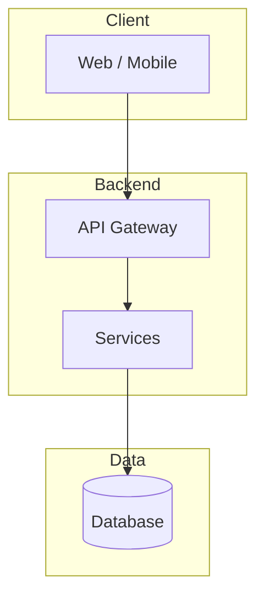

# Mermaid in TDD

**Place:** Architecture diagram section inside `technical-design.md`. Mermaid code blocks; no separate file.

**Types:** flowchart (default; use subgraph), sequenceDiagram, erDiagram, stateDiagram when ticket implies.

**Conventions:** subgraphs, clear labels (`id[Label]`), TB/LR, `-->` / `-.->`; one idea per diagram. For line breaks inside node labels use ` ` (not `\n`), so markdown and renderers show proper breaks.

**Example**

Derive from ticket description and acceptance criteria.
