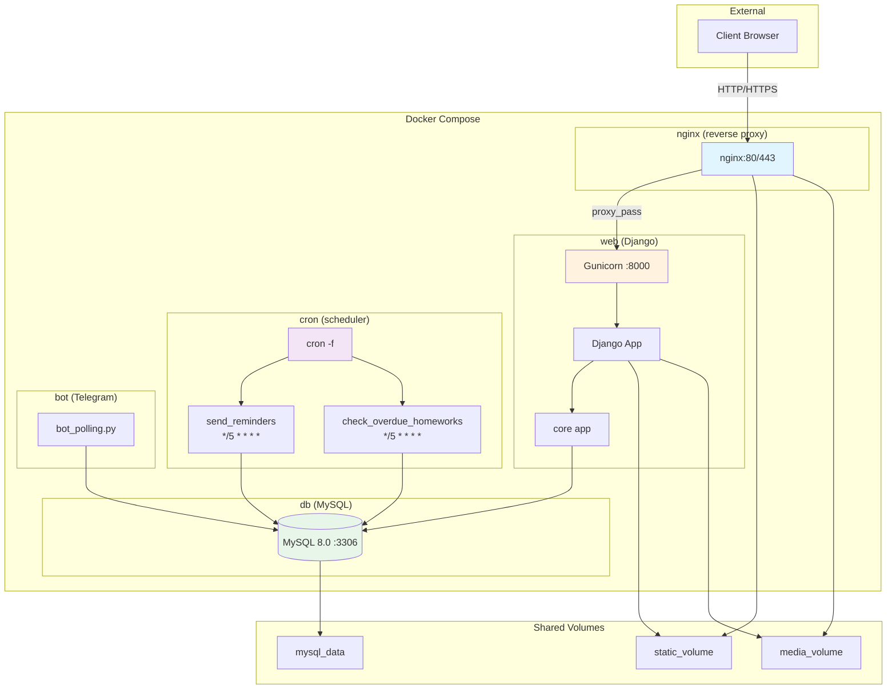
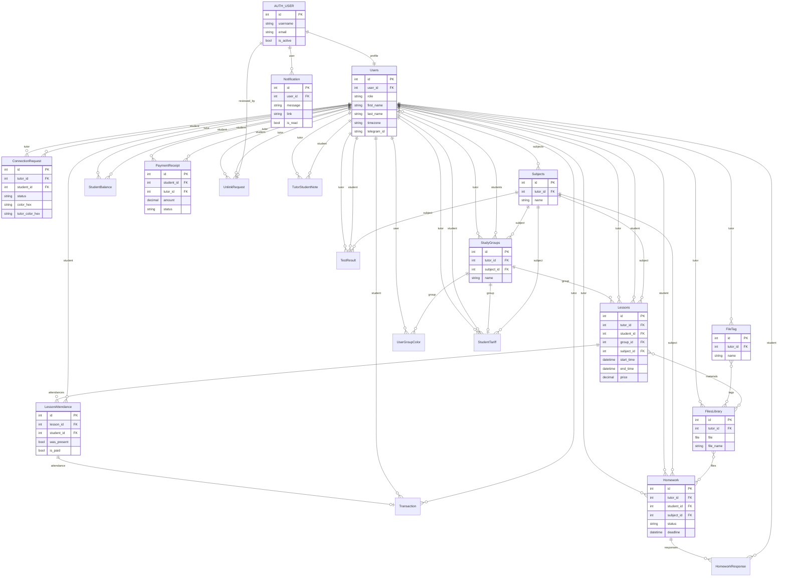
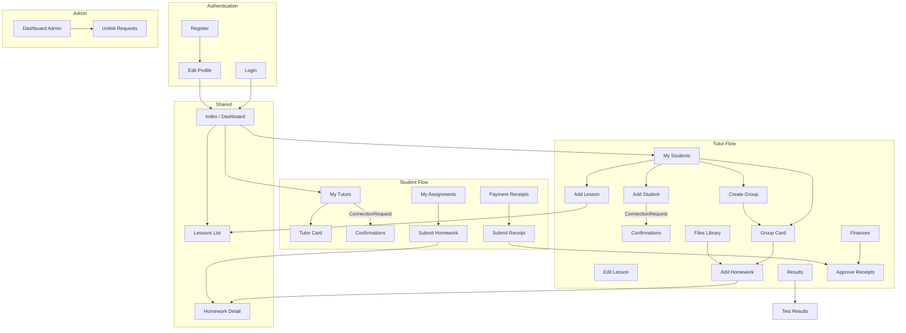
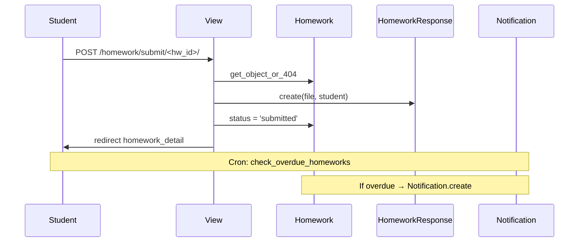
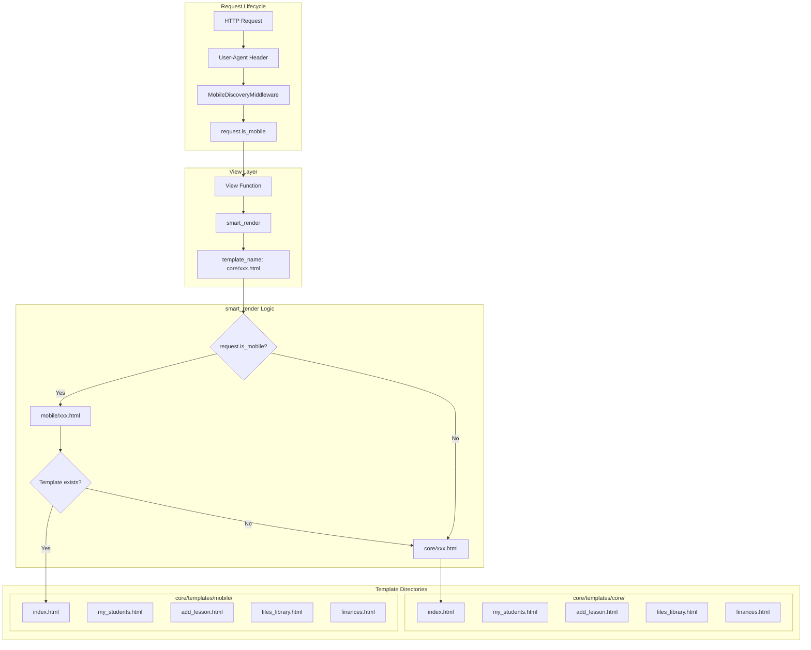
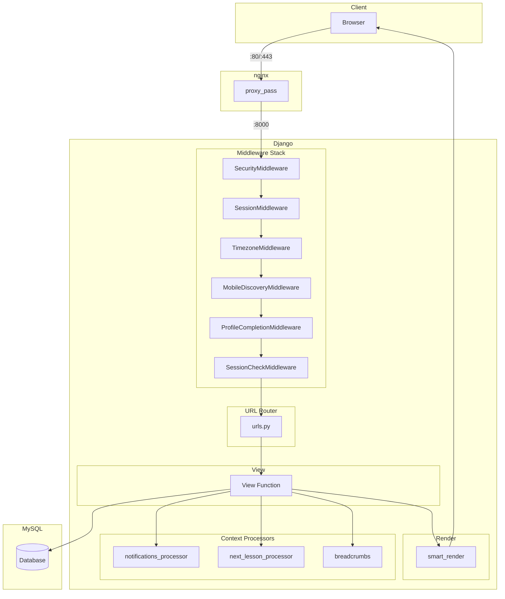

# All4Tutors — Architecture Diagrams

This document contains Mermaid diagrams describing the All4Tutors Django project architecture. The project is a tutoring management platform with roles for tutors, students, and admins.

---

## 1. System Architecture

High-level deployment overview: Docker services, reverse proxy, application server, database, and background jobs.



**Components:**
- **nginx** — Reverse proxy, serves static/media, SSL termination (Certbot)
- **web** — Gunicorn + Django (3 workers, 120s timeout)
- **db** — MySQL 8.0 (`tutor_db`)
- **cron** — Runs `send_reminders` and `check_overdue_homeworks` every 5 minutes
- **bot** — Telegram bot polling for notifications

---

## 2. Data Model (Entity Relationship)

Key models and their relationships.



**Simplified relationship summary:**

| Entity | Key Relationships |
|--------|-------------------|
| **Users** | 1:1 with Auth User; tutor/student; owns Lessons, Homework, FilesLibrary, Subjects |
| **ConnectionRequest** | Links tutor ↔ student (pending/confirmed/rejected/archived) |
| **StudyGroups** | tutor, subject; M2M students |
| **Lessons** | tutor, student, group, subject; M2M materials (FilesLibrary) |
| **LessonAttendance** | lesson, student; drives Transaction, StudentBalance |
| **Homework** | tutor, student, subject; M2M files; has HomeworkResponse |
| **PaymentReceipt** | student → tutor; approve creates Transaction + StudentBalance |

---

## 3. User Flow

How tutors and students interact with the system.



**Sequence: Request flow (student submits homework)**



---

## 4. Template / Rendering Architecture

Desktop vs mobile template selection via `smart_render` and `MobileDiscoveryMiddleware`.



**Mobile detection (MobileDiscoveryMiddleware):**

```mermaid
flowchart LR
    UA[User-Agent] --> Regex[regex: iphone|android|mobile|smartphone|...]
    Regex -->|Match| SetIsMobile[request.is_mobile = True]
    Regex -->|No match| SetIsMobile[request.is_mobile = False]
```

**smart_render implementation:**

```python
# core/views.py (simplified)
def smart_render(request, template_name, context=None):
    if getattr(request, 'is_mobile', False):
        mobile_template = template_name.replace('core/', 'mobile/')
        try:
            get_template(mobile_template)
            return render(request, mobile_template, context)
        except TemplateDoesNotExist:
            pass
    return render(request, template_name, context)
```

**Template parity:**

| Template | core/ | mobile/ |
|----------|-------|---------|
| index | ✓ | ✓ |
| my_students | ✓ | ✓ |
| add_lesson | ✓ | ✓ |
| my_assignments | ✓ | ✓ |
| files_library | ✓ | ✓ |
| finances | ✓ | ✓ |
| group_card | ✓ | ✓ |
| student_card | ✓ | ✓ |
| tutor_card | ✓ | ✓ |
| payment_receipts_* | ✓ | ✓ |
| ... | ... | ... |

**Context processors** (available in all templates): `notifications_processor`, `next_lesson_processor`, `breadcrumbs`.

---

## 5. Request Flow (Simplified)



---

## Diagram Index

| Diagram | Purpose |
|---------|---------|
| **System Architecture** | Docker services, nginx, web, db, cron, bot |
| **Data Model** | ER diagram of core models and relationships |
| **User Flow** | Tutor and student flows |
| **Template/Rendering** | smart_render and `core/` vs `mobile/` |
| **Request Flow** | Middleware → URL → View → Context → Render |

**Assumptions:**
- Auth assumed via Django's built-in auth; `Users` extends via `User.profile`
- Admin panel: Django admin at `/secretplace/`; custom dashboard at `/dashboard/admin/`
- Telegram bot: separate polling process; `send_telegram_notification` used by cron

---

## 6. Физическая модель базы данных

```mermaid
erDiagram
    %% ===== СУЩНОСТИ =====

    auth_user {
        int id PK
        varchar username
        varchar email
        bool is_active
        bool is_superuser
        datetime date_joined
    }

    users {
        int id PK
        int user_id FK "-> auth_user (1:1)"
        varchar last_name
        varchar first_name
        varchar patronymic
        varchar role "tutor | student"
        varchar address
        varchar contact
        varchar telegram_id
        varchar timezone
        varchar school_class
        varchar parent_name
        varchar parent_phone
        uuid session_key
    }

    subjects {
        int id PK
        varchar name
        int tutor_id FK "-> users"
    }

    study_groups {
        int id PK
        varchar name
        int tutor_id FK "-> users"
        int subject_id FK "-> subjects"
    }

    group_members {
        int id PK
        int group_id FK "-> study_groups"
        int student_id FK "-> users"
    }

    lessons {
        int id PK
        int tutor_id FK "-> users"
        int subject_id FK "-> subjects"
        int student_id FK "-> users (nullable)"
        int group_id FK "-> study_groups (nullable)"
        text notes
        text homework
        datetime start_time
        datetime end_time
        int duration
        varchar format
        text location
        bool is_paid
        uuid series_id
        decimal price
        bool reminder_sent
        datetime created_at
        datetime updated_at
    }

    lesson_attendance {
        int id PK
        int lesson_id FK "-> lessons"
        int student_id FK "-> users"
        bool is_paid
        bool was_present
    }

    file_tags {
        int id PK
        int tutor_id FK "-> users"
        varchar name
    }

    files_library {
        int id PK
        int tutor_id FK "-> users"
        varchar file
        varchar file_name
        datetime upload_date
    }

    files_library_tags {
        int id PK
        int fileslibrary_id FK "-> files_library"
        int filetag_id FK "-> file_tags"
    }

    lessons_materials {
        int id PK
        int lesson_id FK "-> lessons"
        int fileslibrary_id FK "-> files_library"
    }

    student_balance {
        int id PK
        int tutor_id FK "-> users"
        int student_id FK "-> users"
        decimal balance
    }

    student_transactions {
        int id PK
        int student_id FK "-> users"
        int tutor_id FK "-> users"
        int attendance_id FK "-> lesson_attendance (nullable)"
        decimal amount
        varchar type "deposit | withdrawal"
        varchar description
        datetime date
    }

    payment_receipts {
        int id PK
        int student_id FK "-> users"
        int tutor_id FK "-> users"
        decimal amount
        date receipt_date
        varchar file
        varchar status "pending | approved | rejected"
        text comment
        datetime created_at
        datetime reviewed_at
    }

    tutor_subjects {
        int id PK
        int tutor_id FK "-> users"
        int subject_id FK "-> subjects"
    }

    connection_requests {
        int id PK
        int tutor_id FK "-> users"
        int student_id FK "-> users"
        varchar status "pending | confirmed | rejected | archived"
        datetime created_at
        varchar color_hex
        varchar tutor_color_hex
    }

    unlink_requests {
        int id PK
        int student_id FK "-> users"
        int tutor_id FK "-> users"
        varchar status "pending | approved | rejected"
        datetime created_at
        datetime reviewed_at
        int reviewed_by_id FK "-> auth_user (nullable)"
    }

    user_group_colors {
        int id PK
        int user_id FK "-> users"
        int group_id FK "-> study_groups"
        varchar color_hex
    }

    student_tariff {
        int id PK
        int tutor_id FK "-> users"
        int student_id FK "-> users (nullable)"
        int group_id FK "-> study_groups (nullable)"
        int subject_id FK "-> subjects"
        decimal price
    }

    student_performance {
        int id PK
        int student_id FK "-> users"
        int lesson_id FK "-> lessons (nullable)"
        varchar type "hw | test"
        int score
        text comment
        date date
    }

    notifications {
        int id PK
        int user_id FK "-> auth_user"
        varchar message
        varchar link
        bool is_read
        datetime created_at
        varchar type "warning | info"
    }

    homework {
        int id PK
        int tutor_id FK "-> users"
        int student_id FK "-> users"
        int subject_id FK "-> subjects"
        text description
        datetime deadline
        varchar status "pending | submitted | revision | completed | overdue"
        bool is_overdue_notified
        text tutor_comment
        datetime created_at
        datetime updated_at
    }

    homework_files {
        int id PK
        int homework_id FK "-> homework"
        int fileslibrary_id FK "-> files_library"
    }

    homework_response {
        int id PK
        int homework_id FK "-> homework"
        varchar file
        varchar file_name
        int student_id FK "-> users (nullable)"
        datetime created_at
        datetime updated_at
    }

    tutor_student_note {
        int id PK
        int tutor_id FK "-> users"
        int student_id FK "-> users"
        text text
        datetime updated_at
    }

    test_results {
        int id PK
        int tutor_id FK "-> users"
        int student_id FK "-> users"
        int subject_id FK "-> subjects"
        decimal max_score
        decimal score
        date date
        text comment
    }

    %% ===== СВЯЗИ =====

    auth_user ||--|| users : "profile"

    users ||--o{ subjects : "tutor"
    users ||--o{ study_groups : "tutor"
    subjects ||--o{ study_groups : "subject"

    study_groups ||--o{ group_members : "group"
    users ||--o{ group_members : "student"

    users ||--o{ lessons : "tutor"
    subjects ||--o{ lessons : "subject"
    users |o--o{ lessons : "student"
    study_groups |o--o{ lessons : "group"

    lessons ||--o{ lesson_attendance : "lesson"
    users ||--o{ lesson_attendance : "student"

    users ||--o{ file_tags : "tutor"
    users ||--o{ files_library : "tutor"
    files_library ||--o{ files_library_tags : "file"
    file_tags ||--o{ files_library_tags : "tag"

    lessons ||--o{ lessons_materials : "lesson"
    files_library ||--o{ lessons_materials : "file"

    users ||--o{ student_balance : "tutor"
    users ||--o{ student_balance : "student"

    users ||--o{ student_transactions : "student"
    users ||--o{ student_transactions : "tutor"
    lesson_attendance |o--o{ student_transactions : "attendance"

    users ||--o{ payment_receipts : "student"
    users ||--o{ payment_receipts : "tutor"

    users ||--o{ tutor_subjects : "tutor"
    subjects ||--o{ tutor_subjects : "subject"

    users ||--o{ connection_requests : "tutor"
    users ||--o{ connection_requests : "student"

    users ||--o{ unlink_requests : "student"
    users ||--o{ unlink_requests : "tutor"
    auth_user |o--o{ unlink_requests : "reviewer"

    users ||--o{ user_group_colors : "user"
    study_groups ||--o{ user_group_colors : "group"

    users ||--o{ student_tariff : "tutor"
    users |o--o{ student_tariff : "student"
    study_groups |o--o{ student_tariff : "group"
    subjects ||--o{ student_tariff : "subject"

    users ||--o{ student_performance : "student"
    lessons |o--o{ student_performance : "lesson"

    auth_user ||--o{ notifications : "user"

    users ||--o{ homework : "tutor"
    users ||--o{ homework : "student"
    subjects ||--o{ homework : "subject"
    homework ||--o{ homework_files : "homework"
    files_library ||--o{ homework_files : "file"

    homework ||--o{ homework_response : "homework"
    users |o--o{ homework_response : "student"

    users ||--o{ tutor_student_note : "tutor"
    users ||--o{ tutor_student_note : "student"

    users ||--o{ test_results : "tutor"
    users ||--o{ test_results : "student"
    subjects ||--o{ test_results : "subject"
```



### Условные обозначения (Crow's Foot Notation)

| Символ | Значение |
|--------|----------|
| `\|\|--\|\|` | Один к одному (1:1) |
| `\|\|--o{` | Один ко многим (1:M), обязательная связь |
| `\|o--o{` | Один ко многим, необязательная сторона (nullable FK) |
| Промежуточные таблицы | Реализация связей M:N |

### Статистика физической модели

| Показатель | Значение |
|---|---|
| Таблиц-сущностей | 23 |
| Промежуточных таблиц (M:N) | 3 (`files_library_tags`, `lessons_materials`, `homework_files`) |
| Таблиц всего | 27 (включая `auth_user`) |
| Связей FK | 48 |
| Уникальных ограничений (UNIQUE) | 9 |
