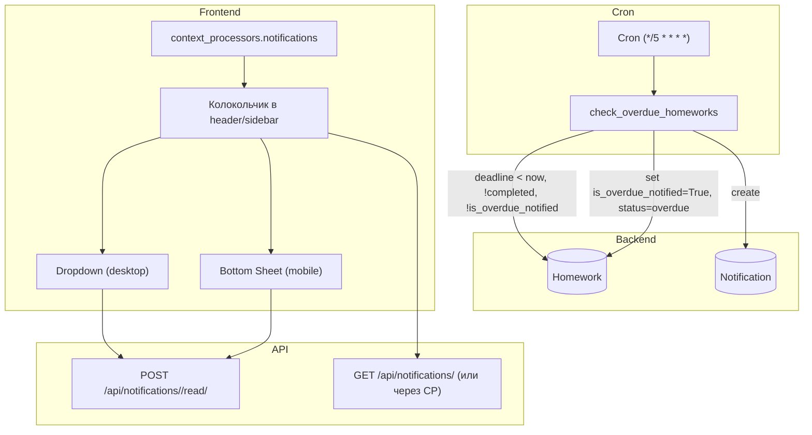

# Эпик: Система уведомлений о просроченных ДЗ — Технический план

**Дата:** 2025-03-04  
**Проект:** All4Tutors (Django, Vanilla JS, Mobile-First)

---

## 1. Результаты аудита архитектуры

| Компонент | Статус | Детали |
|-----------|--------|--------|
| **Notification** | ❌ Отсутствует | Нужно создать модель |
| **Celery** | ❌ Не используется | — |
| **Cron** | ✅ Есть | `docker-compose` → `send_reminders` каждые 5 мин (напоминания об уроках) |
| **Management commands** | ✅ Есть | `core/management/commands/send_reminders.py` |
| **Context processors** | ✅ Есть | `next_lesson_processor`, `breadcrumbs` |
| **Homework.is_overdue** | ✅ Вычисляется в view | `deadline < now` и `status != 'completed'` |
| **Homework.is_overdue_notified** | ❌ Отсутствует | Нужно добавить |
| **Homework.status "overdue"** | ❌ Отсутствует | В STATUS_CHOICES только: pending, submitted, revision, completed |
| **UI бейджи просрочки** | ✅ Частично | `my_assignments`, `index` — бейджи и `hw-row-overdue` есть |
| **Колокольчик уведомлений** | ❌ Отсутствует | Нет в sidebar/header |

---

## 2. Scope

### В scope
- Модель `Notification` и миграция
- Поле `Homework.is_overdue_notified` и статус `overdue` в STATUS_CHOICES
- Management command `check_overdue_homeworks` (cron)
- Центр уведомлений: колокольчик, dropdown (desktop), Bottom Sheet (mobile)
- API: пометить уведомление прочитанным (fetch), список уведомлений
- Контекстный процессор для колокольчика (без N+1)
- Визуализация просроченных ДЗ: красная рамка, бейдж «Просрочено» (уже частично есть — усилить)

### Вне scope
- Websockets, push-уведомления
- Email/Telegram для просрочки (только in-app)
- Celery, Redis, брокеры очередей

---

## 3. Архитектура



---

## 4. Tech stacks и компоненты

| Область | Стек | Файлы |
|---------|------|-------|
| Backend (модели, миграции) | Django, MySQL | `core/models.py`, `core/migrations/` |
| Backend (command) | Django management command | `core/management/commands/check_overdue_homeworks.py` |
| Backend (views, API) | Django views, JSON | `core/views.py`, `tutor_project/urls.py` |
| Context processor | Django | `core/context_processors.py` |
| UI (desktop) | HTML, CSS variables, Vanilla JS | `core/templates/core/base.html`, `static/css/style.css` |
| UI (mobile) | HTML, inline styles + CSS vars | `core/templates/mobile/base.html` |
| Cron | docker-compose | `docker-compose.yml` |

---

## 5. Детальный дизайн компонентов

### 5.1 Модель Notification

```python
class Notification(models.Model):
    TYPE_CHOICES = [('warning', 'Предупреждение'), ('info', 'Информация')]
    user = models.ForeignKey(settings.AUTH_USER_MODEL, on_delete=models.CASCADE, related_name='notifications')
    message = models.CharField(max_length=255)
    link = models.CharField(max_length=500, blank=True, null=True)  # URL для перехода
    is_read = models.BooleanField(default=False)
    created_at = models.DateTimeField(default=timezone.now)
    type = models.CharField(max_length=10, choices=TYPE_CHOICES, default='warning')

    class Meta:
        db_table = 'notifications'
        ordering = ['-created_at']
```

### 5.2 Homework — изменения

- Добавить в `STATUS_CHOICES`: `('overdue', 'Просрочено')`
- Добавить поле: `is_overdue_notified = models.BooleanField(default=False)`

### 5.3 Management Command `check_overdue_homeworks`

**Логика:**
1. `now = timezone.now()`
2. Выбрать ДЗ: `deadline < now`, `status` НЕ в `['completed', 'submitted']`, `is_overdue_notified == False`, `deadline__isnull=False`
3. В `transaction.atomic()` для каждого:
   - `hw.status = 'overdue'`
   - `hw.is_overdue_notified = True`
   - `Notification.objects.create(user=hw.student.user, message=..., link=..., type='warning')`
   - `hw.save()`

**Сообщение:** например: `"Домашнее задание по {subject} просрочено. Сдайте работу как можно скорее."`  
**Ссылка:** `reverse('homework_detail', args=[hw.id])`

### 5.4 Context Processor `notifications_processor`

- Возвращать: `unread_notifications_count`, `recent_notifications` (последние 5–10)
- Только для `request.user.is_authenticated`
- Использовать `select_related` / аннотации, чтобы избежать N+1
- `Notification.objects.filter(user=request.user, is_read=False).count()`
- `Notification.objects.filter(user=request.user).order_by('-created_at')[:10]`

### 5.5 API

- `POST /api/notifications/<id>/read/` — пометить `is_read=True`, вернуть `{"ok": true}`
- Опционально: `GET /api/notifications/` для подгрузки (если не хватает CP)

### 5.6 UI — Колокольчик

**Desktop (base.html):**
- В `sidebar-header` или рядом с `user-profile-mini` — иконка колокольчика
- Красный кружок с `unread_notifications_count` (если > 0)
- По клику — dropdown с `recent_notifications`
- Каждое уведомление: текст, ссылка, при клике → fetch mark read → `window.location = link`

**Mobile (base.html):**
- В `header_right` block — иконка колокольчика (аналогично)
- По клику — Bottom Sheet (как в `tg-modal`) со списком уведомлений

**Стили:**
- `:hover`, `:active` на карточки уведомлений
- CSS-переменные: `var(--danger)`, `var(--bg-card)`, `var(--text-main)`

### 5.7 Карточки просроченных ДЗ

- Уже есть `hw-row-overdue`, `hw-card-overdue`, бейдж «Просрочено»
- Усилить: красная рамка `border: 2px solid var(--danger)` для карточек
- Убедиться, что на 375px не ломается

---

## 6. Порядок реализации (Implementation Order)

### Шаг 1: Backend (модели, миграции, command)
1. Добавить модель `Notification`, миграция
2. Добавить в `Homework`: `is_overdue_notified`, `overdue` в STATUS_CHOICES, миграция
3. Создать `check_overdue_homeworks` management command
4. Добавить в cron (docker-compose) вызов `check_overdue_homeworks` (можно в ту же строку после `send_reminders` или отдельно)

### Шаг 2: Backend (API, context processor)
5. Context processor `notifications_processor`
6. View/API: `mark_notification_read` (POST)
7. Зарегистрировать в settings, urls

### Шаг 3: UI (колокольчик, dropdown, bottom sheet)
8. Desktop: колокольчик в base.html, dropdown, стили
9. Mobile: колокольчик в header_right, Bottom Sheet, стили
10. JS: fetch mark read, переход по ссылке

### Шаг 4: Интеграция и полировка
11. Усилить визуализацию просроченных карточек (красная рамка)
12. Проверить 375px, N+1, дубли уведомлений

---

## 7. Acceptance Criteria (для Verifier)

| ID | Критерий | Как проверить |
|----|----------|---------------|
| AC1 | Уведомление о просрочке отправляется **только один раз** | ДЗ с `deadline < now`, не completed — после первого прогона command `is_overdue_notified=True`, повторный прогон не создаёт новое Notification |
| AC2 | Мобильный UI на 375px не ломается | Колокольчик, Bottom Sheet, карточки ДЗ — без overflow, горизонтального скролла |
| AC3 | Context processor не делает N+1 | Один запрос на count, один на список (или один с аннотацией) |
| AC4 | При клике на уведомление: is_read=True, редирект на ДЗ | Fetch POST, затем `location.href = link` |
| AC5 | Просроченные ДЗ имеют красную рамку и бейдж | Карточка с `border: 2px solid var(--danger)`, бейдж «Просрочено» |

---

## 8. Файлы для изменения/создания

| Действие | Путь |
|----------|------|
| Создать | `core/migrations/0011_notification_homework_overdue.py` |
| Изменить | `core/models.py` |
| Создать | `core/management/commands/check_overdue_homeworks.py` |
| Изменить | `core/context_processors.py` |
| Изменить | `core/views.py` |
| Изменить | `tutor_project/urls.py` |
| Изменить | `tutor_project/settings.py` |
| Изменить | `core/templates/core/base.html` |
| Изменить | `core/templates/mobile/base.html` |
| Изменить | `static/css/style.css` |
| Изменить | `docker-compose.yml` |

---

## 9. Уточнение по статусам Homework

В спецификации: «статус НЕ completed/on_review». В модели:
- `completed` — выполнено
- `submitted` — на проверке (аналог «on_review»)

**Решение:** Не создавать уведомление для `completed` и `submitted` (работа уже сдана, ждёт проверки). Уведомлять только для `pending` и `revision`.
